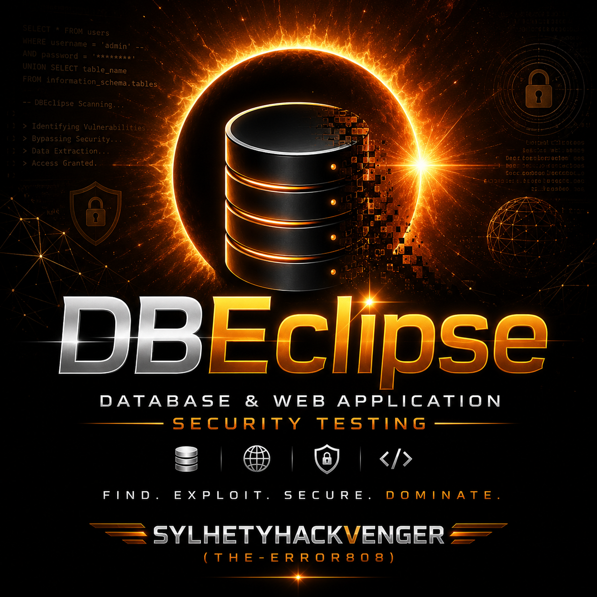
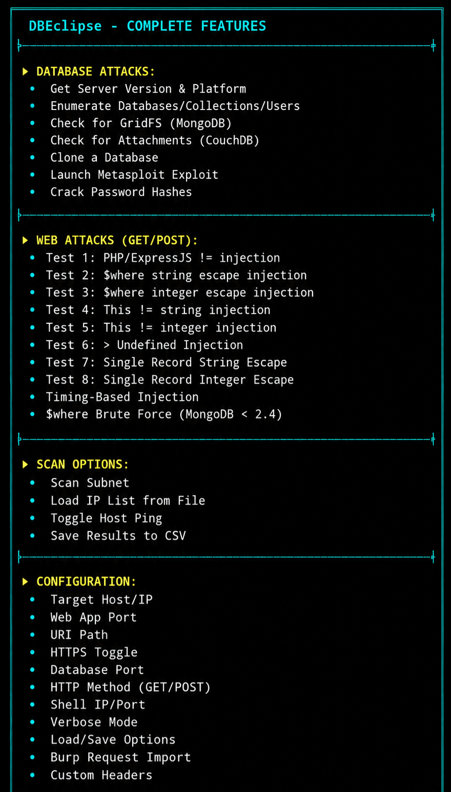

# DBEclipse - Complete NoSQL Security Testing Framework

<p align="center">
  
</p>

---

📖 Overview

DBEclipse is a comprehensive NoSQL security testing framework designed for security professionals, penetration testers, and ethical hackers. It combines the full functionality of NoSQLMap with a modern, futuristic cyberpunk terminal user interface (TUI). Built to identify and exploit NoSQL database misconfigurations and injection vulnerabilities, DBEclipse provides both automated and manual testing capabilities with real-time visual feedback.

---

🚀 Features

🗄️ Database Access Attacks

Feature Description
MongoDB Server version detection, database enumeration, user hash extraction, GridFS discovery, authentication bypass testing
CouchDB Database enumeration, user extraction with password hashes, attachment discovery, replication attacks
Cloning Copy remote databases locally with all documents and collections
Password Cracking Dictionary and brute-force attacks on captured hashes

🌐 Web Application Attacks

Attack Vector Description
PHP/ExpressJS $ne Not equals injection for authentication bypass
$where String JavaScript injection with string escape
$where Integer JavaScript injection with integer escape
$where Single Record Extract single document from database
This != String/Integer this object comparison injection
$gt Undefined Greater-than operator injection
Timing-Based Sleep/benchmark injections for blind exploitation
Burp Integration Import saved Burp Suite requests directly

🔍 Network Scanning

· Subnet scanning for MongoDB/CouchDB (e.g., 192.168.1.0/24)
· Load custom IP lists from files
· Host ping toggle for faster scanning
· CSV export of discovered servers

🎨 Cyberpunk TUI

· Professional dashboard with real-time status
· Color-coded output with ASCII art banner
· Intuitive menu-driven navigation
· Clean exit with Ctrl+C or Ctrl+Z

---

🛠️ Installation

Prerequisites

```bash
# Required dependencies
pip install pymongo couchdb ipcalc pbkdf2 requests
```

Quick Start

```bash
git clone https://github.com/sylhetyhackvenger/DBEclipse
cd DBEclipse
chmod +x DBEclipse.sh
./DBEclipse.sh
```

---

⚙️ Configuration

Configure targets through the options menu:

```yaml
Target Host/IP:     192.168.1.100
Web Port:           80
URI Path:           /api/users
HTTPS:              OFF
Database Port:      27017 (MongoDB) / 5984 (CouchDB)
HTTP Method:        GET / POST
Shell IP/Port:      Your listener IP and port
Verbose Mode:       ON / OFF
```

POST Data Format

```
parameter1,value1,parameter2,value2
```

Headers Format

```
header1,value1,header2,value2
```
<p align="center">
  
</p>
---

📋 Usage Examples

Database Enumeration

```bash
1. Set target: 192.168.1.100
2. Select [2] NoSQL DB Access Attacks
3. Choose [2] Enumerate Databases/Collections/Users
```

Web Injection Testing

```bash
1. Set target and URI: /api/users?id=1
2. Select [3] NoSQL Web App Attacks
3. Choose [6] Run All Tests
```

Network Scan

```bash
1. Select [4] Scan for Anonymous Access
2. Enter subnet: 192.168.1.0/24
```

---

⚠️ Legal Disclaimer

<div align="center">
<strong>⚠️ This tool is for authorized security testing only.</strong>
<br>
Unauthorized access is illegal. Users assume full responsibility.
</div>

IMPORTANT: Only use DBEclipse on systems you own or have explicit written permission to test. The author assumes no liability for misuse or damage caused by this tool.

---

🤝 Contributing

1. Fork the repository
2. Create your feature branch (git checkout -b feature/AmazingFeature)
3. Commit changes (git commit -m 'Add AmazingFeature')
4. Push to branch (git push origin feature/AmazingFeature)
5. Open a Pull Request

---

📄 License

This project is licensed for educational and security testing purposes only. All rights reserved.

---

🔗 Connect

· Author: SYLHETYHACKVENGER (THE-ERROR808)
· GitHub: @SYLHETYHACKVENGER

---

<div align="center">

DBEclipse - Eclipsing NoSQL Security Testing

```

Stay Cyber Secure! 🚀

</div>
